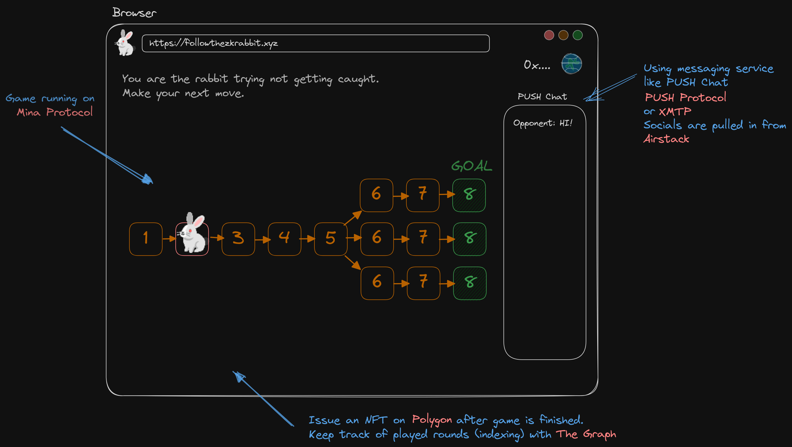

# ETHGlobalParis2023
Follow the zkRabbit. A blockchain game powered by MINA zkApps (snarkyJS).

## Background on zkApps

Mina docs: "zkApps (zero knowledge apps) are Mina Protocol smart contracts powered by zero knowledge proofs, specifically using zk-SNARKs. zkApps use an off-chain execution and mostly off-chain state model. This allows for private computation and state that can be either private or public."

## How to play
tbd
